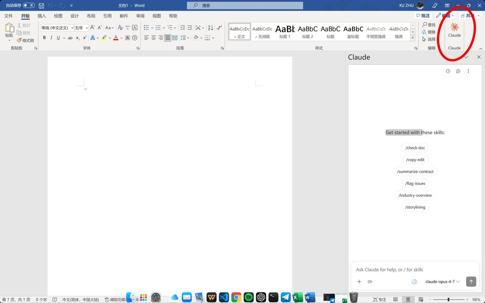

# Office Claude Gateway

<div align="center">

**让 Claude for Office 插件接入国产大模型 API 的轻量网关**

[](LICENSE)
[](https://www.python.org/downloads/)
[](gateway_unified/tests)
[](#3-安装推荐安装向导)

**中文 | 🌐 [English](README.en.md)**

</div>

---

一个面向 **Microsoft Office 插件**（Excel / Word / PowerPoint / Outlook）与
Claude 兼容客户端的 **Anthropic Messages API 网关**。

> 让 Claude for Office 插件（或其他任何支持 Anthropic 协议的工具）无需
> Anthropic 官方账号，即可接入 DeepSeek / Kimi（Moonshot）/ MiMo（小米）/
> MiniMax 等大模型 API。

**核心特性**：
- 🏢 **Office 原生兼容** — 对外保持 Anthropic Messages API 形态
  （`/v1/messages`、`/v1/models`），Claude for Office 插件开箱即用
- 🔀 **多厂商支持** — 一键选择 DeepSeek / Kimi / MiMo / MiniMax，模型名自动映射
- 🎭 **模型别名映射** — 插件发 `claude-sonnet-5` 等 Claude 模型名，网关自动
  映射到各家的真实模型（如 DeepSeek 的 `deepseek-v4-flash`）
- 🌐 **Web Search 自动执行** — 网关内置 DuckDuckGo 搜索，自动回填 `tool_result`
- ♻️ **上游重试** — 5xx / 429 / 网络错误自动重试（指数退避）
- 📊 **Token 用量统计** — 每个请求的 input/output/cache tokens 记入日志
- 🔒 **HTTPS 直连** — uvicorn 自带 TLS，无需额外反代，跨平台可部署

**适用场景**：
- 💼 国内用户想用 Excel/Word 里的 Claude 插件，但没有 Anthropic 官方账号
- 🏢 企业内部想统一管理 Office AI 能力，对接已有的模型 API 配额
- 🧪 开发者想把 Claude 插件接到任何兼容 Anthropic 协议的模型服务

**实际运行效果**（Word 中的 Claude 侧边栏，模型已路由到网关）：



---

## 目录

1. [项目原理](#1-项目原理)
2. [支持的厂商与模型映射](#2-支持的厂商与模型映射)
3. [安装（推荐：安装向导）](#3-安装推荐安装向导)
4. [手动安装](#4-手动安装)
5. [插件配置](#5-插件配置)
6. [客户端证书安装](#6-客户端证书安装)
7. [开机自启（systemd）](#7-开机自启systemd)
8. [配置参考](#8-配置参考)
9. [Web Search 能力](#9-web-search-能力)
10. [对外接口](#10-对外接口)
11. [测试](#11-测试)

---

## 1. 项目原理

### 它解决什么问题

Microsoft 的 **Claude for Office** 插件（Excel / Word / PowerPoint / Outlook
共用同一套）默认只能连接 Anthropic 官方 API。但 Anthropic 官方账号：
- 国内无法直接访问/注册
- 需要外币信用卡
- 按美元计费，成本高

这个网关在中间做了一层**协议转换 + 路由**：

```
┌──────────────┐     Anthropic Messages API      ┌──────────────────┐
│  Excel/Word  │ ──POST /v1/messages───────────► │  Office Claude   │
│  PPT/Outlook │     model: claude-sonnet-5       │     Gateway      │
│  (Claude插件)│ ◄──SSE 流式响应───────────────── │  (HTTPS 8443)    │
└──────────────┘                                  └────────┬─────────┘
                                                           │ 厂商选择
                                                           ▼
                              ┌──────────┬──────────┬──────────┬──────────┐
                              │ DeepSeek │  Kimi    │   MiMo   │ MiniMax  │
                              └──────────┴──────────┴──────────┴──────────┘
                                  （各家都支持 Anthropic 协议的 /v1/messages）
```

### 工作流程

1. **插件发请求** — Office 插件向网关发标准 Anthropic 格式请求
2. **网关清洗** — 过滤插件发的、但上游不支持的 content block，限制请求体大小
3. **模型映射** — 把 `claude-opus-4-7` / `claude-sonnet-5` 等映射到所选
   厂商的真实模型
4. **路由转发** — 按配置的厂商转发给对应上游
5. **流式透传** — 上游的 SSE 流式响应经网关"修正"后透传给插件
6. **用量统计** — 从响应中提取 token 用量写入日志

### 为什么上游都能接

DeepSeek / Kimi / MiMo / MiniMax 四家都**官方支持 Anthropic 协议的
`/v1/messages` 接口**（各自开放了 `/anthropic` 路径），所以网关只需要
改 model 名 + 转发即可。

---

## 2. 支持的厂商与模型映射

### 支持的厂商

| 厂商 | 需要 | 说明 |
|---|---|---|
| **DeepSeek** | `DEEPSEEK_API_KEY` | 默认推荐，便宜稳定 |
| **Kimi** (Moonshot) | `KIMI_API_KEY` | 支持 Coding Plan / PAYG，支持图片 |
| **MiMo** (小米) | `MIMO_API_KEY` | 支持 PAYG / Token Plan，多区域 |
| **MiniMax** | `MINIMAX_API_KEY` | 支持 PAYG / Coding Plan，支持图片 |

### 模型映射表

插件侧看到的是 Claude 模型名，网关自动映射到各厂商真实模型：

| 插件发 | DeepSeek | Kimi | MiMo | MiniMax |
|---|---|---|---|---|
| `claude-opus-4-7` / `opus` | `deepseek-v4-pro` | `kimi-k2.6` | `mimo-v2.5-pro` | `MiniMax-M2.7` |
| `claude-sonnet-5` / `sonnet` | `deepseek-v4-flash` | `kimi-k2.5` | `mimo-v2.5` | `MiniMax-M2.5` |

可通过环境变量覆盖：`MODEL_PRIMARY` / `MODEL_MID` / `MODEL_FAST`。

### 模型版本号说明

插件（2026 版）对模型版本有要求：
- **Outlook** 需要 Claude Opus 4.7+ 和 Sonnet 5+
- 因此网关 `/v1/models` 返回 **`claude-opus-4-7`** 和 **`claude-sonnet-5`**
- 旧的 `claude-opus-4-5` / `claude-sonnet-4-5` 会导致插件反复查询模型但无法进入对话
- 故意**不暴露 Haiku**，避免插件出现不需要的第三档选项

---

## 3. 安装（推荐：安装向导）

项目自带**三平台安装向导**，交互式终端，按提示完成全部安装：

| 平台 | 命令 |
|---|---|
| **Linux** | `bash install-linux.sh` |
| **macOS** | `bash install-mac.sh` |
| **Windows**（Git Bash） | `bash install-windows.sh` |

向导会依次引导你：

1. **选择厂商** — DeepSeek / Kimi / MiMo / MiniMax 四选一
2. **填写 API key** — 粘贴你的厂商 key
3. **是否开启局域网** — `y` 则监听 `0.0.0.0` 并**自动检测本机局域网 IP**
   （多网卡时列出候选让你选，无需手动查询）；`n` 则仅本机
   `https://127.0.0.1:8443`
4. **自动生成 HTTPS 证书** — 自动下载 mkcert、生成证书 + CA，并**打印证书
   完整路径**（方便复制到其他设备安装信任）
5. **写入配置** — 自动更新 `.env`（ACTIVE_PROVIDER + API key）
6. **安装依赖** — 自动创建 venv 并安装
7. **是否开机自启** — `y` 则自动安装自启服务（Linux systemd / macOS launchd /
   Windows 计划任务）；`n` 则跳过，打印手动启动命令
8. **验证** — 自动检查网关是否就绪

安装完成后会打印：

```
插件里填写：
  Gateway URL: https://192.168.10.5:8443
  API Token:   sk-xxx***（你的 key）

客户端证书（其他设备安装用）：
  ~/office-gateway-certs/mkcert-rootCA.crt
  装到「受信任的根证书颁发机构」后重启 Office

证书文件位置：
  ~/office-gateway-certs/
```

---

## 4. 手动安装

不想用向导也可以手动操作（跨平台，Linux / macOS / Windows 均可）：

### 4.1 环境要求

- **Python 3.10+**
- **mkcert**（https://github.com/FiloSottile/mkcert/releases）

### 4.2 安装依赖

```bash
cd gateway_unified
python -m venv .venv
.venv/bin/pip install -e .
```

### 4.3 生成证书

```bash
mkdir -p ~/office-gateway-certs && cd ~/office-gateway-certs
mkcert -install
mkcert 192.168.10.5 localhost 127.0.0.1    # 换成你的局域网 IP
cp ~/.local/share/mkcert/rootCA.pem mkcert-rootCA.crt
```

### 4.4 配置 .env

```bash
cd gateway_unified
cp .env.example .env
# 编辑 .env，设置 ACTIVE_PROVIDER 和对应 API key
```

### 4.5 启动（HTTPS 直连）

```bash
cd gateway_unified && source .venv/bin/activate
python -m uvicorn --app-dir src claude_gateway.main:app \
  --host 0.0.0.0 --port 8443 \
  --ssl-keyfile ~/office-gateway-certs/192.168.10.5+2-key.pem \
  --ssl-certfile ~/office-gateway-certs/192.168.10.5+2.pem
```

- `--host 0.0.0.0`：**开启局域网**，其他设备通过 `https://<IP>:8443` 访问
- `--host 127.0.0.1`：**仅本机**，通过 `https://127.0.0.1:8443` 访问

> **为什么不用 nginx？** 不需要。uvicorn 原生支持 `--ssl-keyfile/--ssl-certfile`，
> 直接对外提供 HTTPS。更简单、跨平台、少一个组件。CORS 由网关自身处理。

验证：

```bash
curl -sk https://127.0.0.1:8443/healthz
# → {"status":"ok","provider":"deepseek"}
```

---

## 5. 插件配置

在 Claude for Office 插件设置里（Cloud provider or gateway → Gateway）：

| 字段 | 值 |
|---|---|
| **Gateway URL** | `https://192.168.10.x:8443` |
| **API Token** | 你的厂商 API key（安装时填的那个） |

插件会用该 URL 自动调用：
- `GET /v1/models`（登录时发现模型）
- `POST /v1/messages`（对话）

> ⚠️ **插件只支持 HTTPS**——它的 taskpane 从 `https://pivot.claude.ai` 加载，
> 浏览器禁止混合内容，填 `http://` 会直接 "Failed to fetch"。

---

## 6. 客户端证书安装

网关的 HTTPS 证书由本地 mkcert CA 签发，**客户端设备必须信任该 CA**：

### 6.1 Windows

1. 把 `mkcert-rootCA.crt`（网关机器 `~/office-gateway-certs/` 下）传到 Windows
2. **双击 → 安装证书** → 存储位置选「**本地计算机**」（需管理员权限）
3. 「将所有证书都放入下列存储」→ 浏览 → **受信任的根证书颁发机构** → 完成
4. **完全退出并重启 Excel**（WebView 才重载证书库）

验证装上了（PowerShell）：

```powershell
Get-ChildItem Cert:\LocalMachine\Root | Where-Object {$_.Subject -like "*mkcert*"}
```

### 6.2 macOS

1. 双击 `mkcert-rootCA.crt`
2. 钥匙串访问 → 证书 → 设为「始终信任」

### 6.3 证书排障速查

```powershell
Test-NetConnection 192.168.10.5 -Port 8443      # False = 网络/防火墙问题
curl.exe -v https://192.168.10.5:8443/healthz   # 看证书错误
```

| 报错 | 含义 | 解法 |
|---|---|---|
| `SEC_E_UNTRUSTED_ROOT` (0x80090325) | CA 没装进根证书库 | 重装到「受信任的根证书颁发机构」 |
| `CRYPT_E_NO_REVOCATION_CHECK` (0x80092012) | 吊销检查失败 | **正常**，内网证书无 CRL，忽略 |
| 返回 `{"status":"ok"...}` | 证书 OK | 问题在插件层：重启 Excel |

---

## 7. 开机自启（systemd）

安装向导会自动创建并启用自启服务（Linux systemd / macOS launchd / Windows
计划任务）；选择「不开机自启」则跳过。以下是各平台手动配置方法。

### 7.1 Linux（systemd）

`~/.config/systemd/user/office-claude-gateway.service`：

```ini
[Unit]
Description=Office Claude Gateway (Python/FastAPI, HTTPS)
After=network-online.target
Wants=network-online.target
StartLimitIntervalSec=0

[Service]
Type=simple
WorkingDirectory=/home/zzbond/projects/office-claude-gateway/gateway_unified
ExecStart=/home/zzbond/projects/office-claude-gateway/gateway_unified/.venv/bin/python -m uvicorn --app-dir src claude_gateway.main:app --host 0.0.0.0 --port 8443 --ssl-keyfile /home/zzbond/office-gateway-certs/192.168.10.5+2-key.pem --ssl-certfile /home/zzbond/office-gateway-certs/192.168.10.5+2.pem
Restart=on-failure
RestartSec=3
Environment=PYTHONUNBUFFERED=1

[Install]
WantedBy=default.target
```

启用并启动：

```bash
systemctl --user daemon-reload
systemctl --user enable --now office-claude-gateway.service

# 常用命令
systemctl --user status office-claude-gateway.service   # 状态
systemctl --user restart office-claude-gateway.service  # 重启
journalctl --user -u office-claude-gateway.service -f   # 日志
```

> 注意：`ExecStart` 用 `python -m uvicorn` 而非 `uvicorn` 可执行文件
> （项目 venv 的 uvicorn 装在 site-packages 但无 bin 入口）。

### 7.2 macOS（launchd）

安装向导会生成 `~/Library/LaunchAgents/com.officeclaude.gateway.plist`。
手动创建同文件即可，关键项：`RunAtLoad=true`（登录启动）、`KeepAlive=true`
（崩溃重启）、`StandardOutPath/StandardErrorPath` 指向日志文件。

```bash
launchctl load ~/Library/LaunchAgents/com.officeclaude.gateway.plist
# 卸载：launchctl unload ...
```

### 7.3 Windows（计划任务）

安装向导会生成启动脚本 `~/office-claude-gateway-start.bat` 并用
`schtasks /Create /SC ONSTART` 注册开机任务（需管理员权限）。

手动方式：Win+R → `shell:startup`，把启动 .bat 放进去即可开机自启。

---

## 8. 配置参考

| 变量 | 默认 | 说明 |
|---|---|---|
| `ACTIVE_PROVIDER` | `deepseek` | 运行厂商：deepseek / kimi / mimo / minimax |
| `GATEWAY_PORT` | `8443` | 监听端口 |
| `MAX_REQUEST_BODY_BYTES` | `4MB` | 请求体上限 |
| `DEFAULT_MAX_TOKENS` | `4096` | 默认 max_tokens |
| `ALIAS_OPUS_VERSIONED` | `claude-opus-4-7` | Opus 对外模型名 |
| `ALIAS_SONNET_VERSIONED` | `claude-sonnet-5` | Sonnet 对外模型名 |
| `MODEL_PRIMARY/MID/FAST` | 厂商相关 | 三档真实模型名 |
| `LOG_CONTENT_REDACT` | `true` | 日志脱敏 |
| `ALLOWED_ORIGIN` | `https://pivot.claude.ai` | CORS 允许来源（勿改） |
| `UPSTREAM_RETRY_ATTEMPTS` | `3` | 上游重试次数 |
| `UPSTREAM_RETRY_BASE_DELAY` | `0.5` | 重试基础退避秒 |

常用配置（DeepSeek）：

```env
ACTIVE_PROVIDER=deepseek
DEEPSEEK_API_KEY=sk-xxx
ALIAS_OPUS_VERSIONED=claude-opus-4-7
ALIAS_SONNET_VERSIONED=claude-sonnet-5
```

---

## 9. Web Search 能力

```env
ENABLE_WEB_SEARCH_TOOL=false          # 是否启用 web search 工具
ENABLE_AUTO_WEB_SEARCH_EXECUTION=true # 网关是否自动执行搜索
AUTO_WEB_SEARCH_MAX_RESULTS=5         # 每次搜索返回结果数
AUTO_WEB_SEARCH_TIMEOUT_SECONDS=20    # 搜索超时
AUTO_WEB_SEARCH_MAX_ROUNDS=2          # 最大自动搜索轮数
```

**模式 A：仅透传** — `ENABLE_WEB_SEARCH_TOOL=true` +
`ENABLE_AUTO_WEB_SEARCH_EXECUTION=false`：透传 web_search 结构，是否联网看上游。

**模式 B：网关自动执行（推荐）** — 网关把 web_search 规范成 client tool，
本地 DuckDuckGo 搜索并回填 `tool_result`，多轮收敛，XML tool_call 兜底。

---

## 10. 对外接口

| 方法 | 路径 | 说明 |
|---|---|---|
| `GET` | `/healthz` | 健康检查 |
| `GET` | `/v1/models`（兼容 `/models`） | 模型列表 |
| `POST` | `/v1/messages` | 对话/生成主接口（支持流式 SSE） |

---

## 11. 测试

```bash
cd gateway_unified
pip install -e ".[dev]"
pytest tests/ -v          # 109 tests
```

覆盖：厂商路由、模型映射、输入清洗、SSE 分片、重试、token 用量、Web Search 回路。

---

## License

MIT
